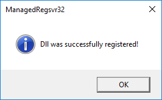

# ManagedRegsvr32
A open source managed version of the Microsoft Regsvr32.exe tool. I made this clone because the Regsvr32 shipped with Windows always returns zero, which makes it impossible to determine if registration succeeded or failed from a batch script. 

### Usage
From Cmd or Powershell

Register a COM module
```
ManagedRegsvr32 "C:\COM_Module.dll"
```
UnRegister a COM module
```
ManagedRegsvr32 -u "C:\COM_Module.dll"
```


Use -s to silently register or unregister components
```
ManagedRegsvr32 -s "C:\COM_Module.dll"
```

This also works with OCX files as Regsvr32 does
```
ManagedRegsvr32 "C:\COM_Module.ocx"
```

If you need to register multiple files you can specify each module one after another or drag and drop modules onto the exe to process them all.
```
ManagedRegsvr32 "C:\COM_Module.dll" "C:\COM_Dep.dll"
```
*Note* If registration fails ManagedRegsvr32 will stop processing any additional files.

### FAQ
**Failed to find DllRegisterServer or DllUnRegisterSever and the module is a COM object**
- Often ManagedRegsvr32 fails to find the Dll entry point because it has not been invoked as a admin process

**Check if the module is compatible with x86 or x64**
- If using the x86 version of ManagedRegsvr32 try using the x64 version.
